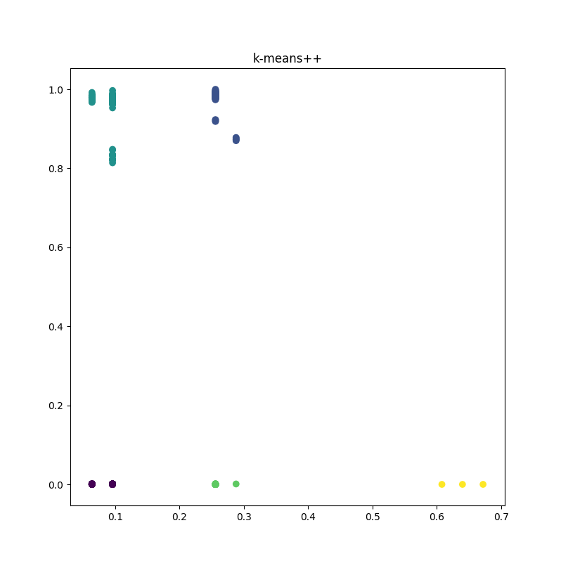

Morsecode
=========

This is a simple morse code docoder that uses `scikit-learn`'s K-means++ algorithm in order to detect clusters. Still in beta. Test data wave-files should be encoded with 8000 Hz and 16 bit signed integers PCM encoding.


## Screenshot




## Requirements

 - Python 3.7.0
 - `pip`, `wget`, `unzip`, `bash`


## Installation

There's a convenient installation script that takes care of downloading the audio test files and installing the dependencies.

```
./install.sh
```


## Run

**1.) Start environment:**

```
source morsecode-env/bin/activate
```

**2.) Run scripts:**

```
python3 src/__init__.py
```

**3.) Stop environment:**
```
deactivate
```


## Test files

In the last lines of the script the following text should appear:

`Y3POCL0TOB48OA23PP4X`
 
